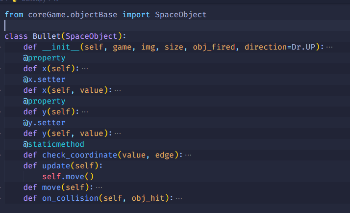

# SpaceGame
SpaceGame is game built using pygame, by [salah besbes](https://github.com/salahbesbes)
# Motivation
SpaceGame is a sideProject done while still learnning Python, the purpse of this project is to learn more about Pyhton and to practice my skills with the OOP since it's my first time, and get familiare with the Logic behind any Game, in fact I want to learn New ways of thinking and new concepts .
# Screenshots
|  |  |
| ------------ | ------- |
|        |   |
# Features
- breaking down the project into smaller manageable pieces, and then breaking them into even smaller pieces so that I could have functions that each only did one thing
- A class is an abstract blueprint used to create more specific
- test some cases using unittest
- Sound on fire and in the background 
# Code Example

  
   
  
  

# installation on Windows
Install [python](https://www.python.org/ftp/python/3.9.10/python-3.9.10-amd64.exe)

Check those options:

	All User
	Add python to envirement variables options

  

Install pygame, Open Terminal and Type
	
	pip install pygame

DownLoad the Game (make sure you have [git](https://git-scm.com/downloads)):
		
		git clone https://github.com/salahbesbes/SpaceGame.git
Run the Game:

	cd SpaceGame
	python3 main.py

# Installation on Ubuntu

Install Requirement:

		sudo apt update -y 
		sudo apt -y upgrade   
		sudo apt install -y build-essential libssl-dev libffi-dev python3-dev
		sudo apt install -y python3-pip git
		pip3 install pygame

Download the Game:

		git clone https://github.com/salahbesbes/
		SpaceGame.git

Run the Game:

		cd SpaceGame
		python3 main.py
		
# Licence
This project is not Licensed yet.
